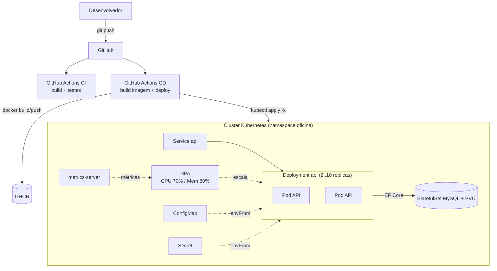
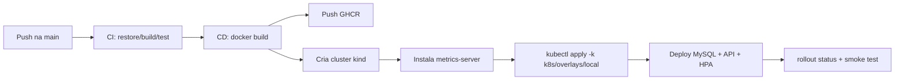
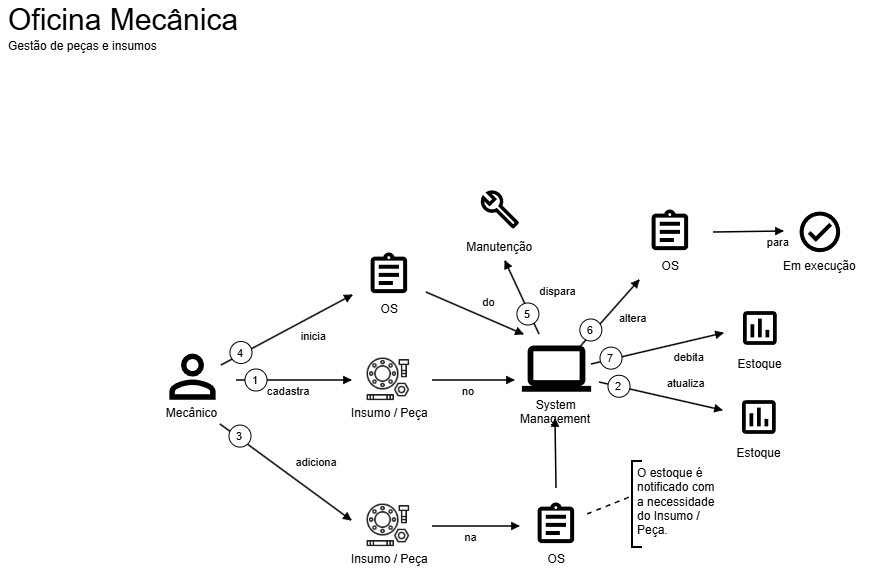
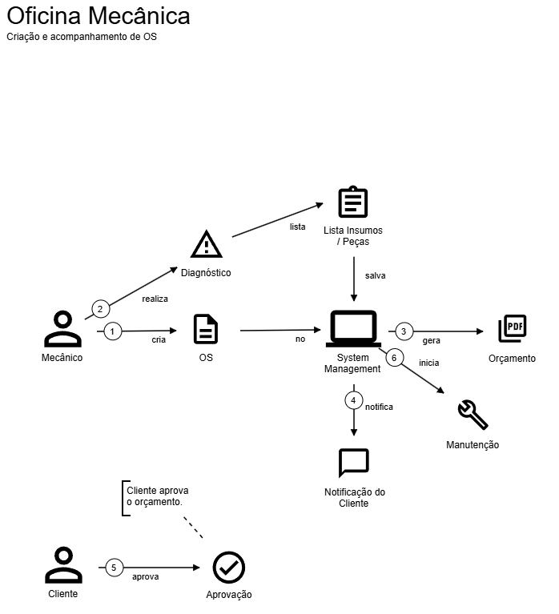
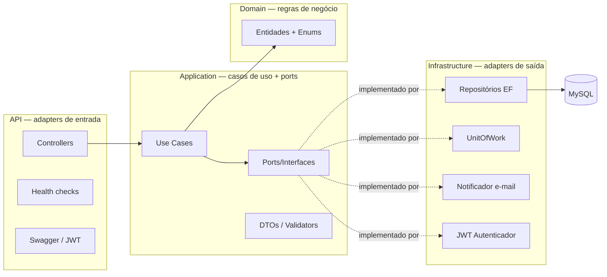

# Tech Challenge FIAP — Oficina Mecânica Backend

API REST para gestão de uma oficina mecânica de médio porte, desenvolvida como Tech Challenge do curso de Software Architecture (15SOAT) da FIAP.

---

## Fase 3 — Operação Corporativa em Nuvem (segurança, escala e observabilidade)

A Fase 3 leva a aplicação a operação corporativa na **AWS**, com autenticação por CPF via
serverless, infraestrutura como código, CI/CD por repositório e observabilidade completa.

### O que foi entregue

| Requisito | Entrega |
| --- | --- |
| **Autenticação por CPF + API Gateway** | Function serverless (Node/TS) valida CPF, consulta o cliente e emite JWT; Lambda Authorizer protege `/api/*`. Ver [`lambda-auth/`](lambda-auth). |
| **Function Serverless (JWT)** | AWS Lambda + API Gateway (HTTP API), IaC em [`lambda-auth/terraform`](lambda-auth/terraform). |
| **4 repositórios com CI/CD** | `oficina-app` (este), `oficina-lambda-auth`, `oficina-infra-k8s`, `oficina-infra-database`. Split: [docs/fase3-entrega.md](docs/fase3-entrega.md). |
| **Banco gerenciado (Terraform)** | Amazon RDS for MySQL Multi-AZ em [`infra-database/`](infra-database). |
| **Cluster K8s escalável (Terraform)** | VPC + EKS + HPA + add-ons em [`infra-k8s/`](infra-k8s). |
| **Observabilidade (New Relic)** | APM + infra + logs JSON + dashboards + alertas. Ver [docs/observability](docs/observability). |
| **Logs estruturados + correlação** | Serilog `CompactJsonFormatter` + middleware `X-Correlation-ID`. |
| **Documentação arquitetural** | Componentes, sequência, RFCs, ADRs e modelo ER: [docs/architecture](docs/architecture). |

### Deploy em produção (AWS/EKS)

O app usa o overlay `k8s/overlays/aws` (RDS + NLB via TargetGroupBinding); o deploy é
automático pelas branches `homolog`/`prod` (`.github/workflows/cd-aws.yml`). Detalhes e
pré-requisitos: [docs/fase3-entrega.md](docs/fase3-entrega.md).

---

## Fase 2 — Infraestrutura, Escalabilidade e Automação

A Fase 2 evolui a aplicação da Fase 1 para garantir **qualidade, resiliência e
escalabilidade**, incorporando práticas modernas de infraestrutura e automação.

### Objetivos e o que foi entregue

| Requisito                                                  | Entrega                                                                                                                                                                                                                                           |
| ---------------------------------------------------------- | ------------------------------------------------------------------------------------------------------------------------------------------------------------------------------------------------------------------------------------------------- |
| **Clean Architecture**                                     | Refatoração em 4 projetos (Domain / Application / Infrastructure / API) com inversão de dependências via ports. Ver [Arquitetura](#arquitetura).                                                                                                  |
| **Clean Code + testes**                                    | Casos de uso coesos, nomes claros; testes unitários (casos de uso sobre SQLite) e de integração (Testcontainers/MySQL).                                                                                                                           |
| **Abertura / Consulta de status / Aprovação de orçamento** | Endpoints de OS mantidos e migrados para casos de uso. Ver [Endpoints](#endpoints-da-api).                                                                                                                                                        |
| **Listagem de OS ordenada**                                | `GET /api/ordens-servico` ordena por prioridade de status (Em Execução → Aguardando Aprovação → Em Diagnóstico → Recebida), mais antigas primeiro, e **exclui logicamente** OS finalizadas/entregues (`?incluirConcluidas=true` para incluí-las). |
| **Atualização de status via e-mail**                       | A cada transição de status, o caso de uso dispara `INotificadorStatus`; o adapter grava um registro de **outbox** (`NotificacoesOutbox`) e loga o envio (e-mail **simulado**, sem SMTP real).                                                     |
| **Conteinerização**                                        | `Dockerfile` (multi-stage, usuário não-root) + `docker-compose.yml` para desenvolvimento local.                                                                                                                                                   |
| **Kubernetes**                                             | Manifestos em [`/k8s`](k8s): Namespace, ConfigMap, Secret, MySQL (StatefulSet + PVC), API (Deployment + Service com probes) e **HPA**.                                                                                                            |
| **IaC (Terraform)**                                        | Scripts em [`/infra`](infra) que provisionam um cluster **kind**, instalam o metrics-server, buildam/carregam a imagem e aplicam os manifestos.                                                                                                   |
| **CI/CD**                                                  | GitHub Actions em [`.github/workflows`](.github/workflows): `ci.yml` (build + testes) e `cd.yml` (build/push da imagem + deploy num kind no runner).                                                                                              |

### Arquitetura de infraestrutura



### Fluxo de deploy



### Collection das APIs

- **Swagger UI** (disponível em ambiente Development): `http://localhost:8080/swagger` — contém todos os endpoints e schemas. O JSON OpenAPI fica em `http://localhost:8080/swagger/v1/swagger.json` e pode ser importado no Postman/Insomnia.

### Vídeo demonstrativo

- 🎬 **Link do vídeo (≤ 15 min):** _[adicionar link do YouTube/Vimeo]_ — demonstra deploy, execução do CI/CD, consumo das APIs e escalabilidade automática (HPA sob carga).

### Entrega

- Repositório compartilhado com o usuário **`soat-architecture`** (passo manual no GitHub: _Settings → Collaborators_).

---

## Sumário

- [Fase 2 — Infraestrutura, Escalabilidade e Automação](#fase-2--infraestrutura-escalabilidade-e-automação)
- [Dicionário de Linguagem Ubíqua](#dicionário-de-linguagem-ubíqua)
- [Stack Tecnológica](#stack-tecnológica)
- [Arquitetura](#arquitetura)
- [Pré-requisitos](#pré-requisitos)
- [Como Executar](#como-executar)
- [Deploy em Kubernetes](#deploy-em-kubernetes)
- [Provisionamento com Terraform](#provisionamento-com-terraform)
- [Configuração](#configuração)
- [Endpoints da API](#endpoints-da-api)
- [Fluxo de Status da OS](#fluxo-de-status-da-os)
- [Autenticação](#autenticação)
- [Testes](#testes)
- [Análise de Segurança](#análise-de-segurança)
- [Estrutura do Projeto](#estrutura-do-projeto)

---

## Dicionário de Linguagem Ubíqua

| Termo                     | Definição                                                                                                        |
| ------------------------- | ---------------------------------------------------------------------------------------------------------------- |
| **Ordem de Serviço (OS)** | Entidade principal que agrega o cliente, o veículo, os serviços e as peças de um atendimento.                    |
| **Cliente**               | Pessoa física ou jurídica proprietária do veículo, identificada por CPF ou CNPJ.                                 |
| **Veículo**               | Automóvel pertencente a um cliente, identificado pela placa (formato antigo ou Mercosul).                        |
| **Serviço**               | Mão de obra executada na OS (ex.: alinhamento, troca de óleo). Possui preço-base cadastrado.                     |
| **Insumo / Peça**         | Material físico utilizado no reparo. Possui controle de estoque mínimo e valor comercial.                        |
| **Orçamento**             | Somatório automático de serviços e peças da OS, enviado para aprovação do cliente.                               |
| **Status da OS**          | Estado do ciclo de vida: Recebida → Em Diagnóstico → Aguardando Aprovação → Em Execução → Finalizada → Entregue. |
| **Tempo de Execução**     | Métrica que monitora a duração do serviço para análise de eficiência.                                            |
| **CRUD Administrativo**   | Operações de gestão dos cadastros-base (clientes, veículos, serviços, peças) protegidas por JWT.                 |

---

# Domain Storytelling





# Event Storming

## Stack Tecnológica

| Camada         | Tecnologia                                                 |
| -------------- | ---------------------------------------------------------- |
| Runtime        | .NET 8.0 / ASP.NET Core                                    |
| ORM            | Entity Framework Core 8 + Pomelo MySQL                     |
| Banco de dados | MySQL 8.4                                                  |
| Autenticação   | JWT Bearer (Microsoft.AspNetCore.Authentication.JwtBearer) |
| Validação      | FluentValidation 11.3                                      |
| Logging        | Serilog (console + arquivo rotativo)                       |
| Documentação   | Swagger / Swashbuckle 6.9                                  |
| Testes         | xUnit + WebApplicationFactory + Testcontainers (MySQL)     |
| Containers     | Docker + Docker Compose                                    |

### Por que MySQL?

A escolha do MySQL 8.4 como banco de dados para o domínio de oficina mecânica se justifica por:

- **Modelo relacional aderente ao domínio** — as entidades (Cliente, Veículo, Ordem de Serviço, Item, Peça, Serviço) têm relacionamentos bem definidos e regras de integridade referencial (ex.: uma OS não pode existir sem cliente e veículo). Um banco relacional com chaves estrangeiras e constraints modela esse cenário de forma natural e segura, evitando dados órfãos.
- **Consistência transacional (ACID)** — operações como adicionar itens à OS e debitar o estoque de peças precisam ser atômicas. O suporte transacional do MySQL (usado via `IUnitOfWork.IniciarTransacaoAsync` no caso de uso de OS) garante que estoque e valor total nunca fiquem inconsistentes diante de falhas.
- **Integridade e unicidade** — índices únicos (CPF/CNPJ do cliente, placa do veículo, número da OS) são aplicados no nível do banco, oferecendo uma última linha de defesa contra duplicidades mesmo sob concorrência.
- **Custo e ecossistema** — é open source, gratuito, maduro e amplamente suportado, com imagem Docker oficial (`mysql:8.4`), o que simplifica desenvolvimento, CI e deploy sem custo de licenciamento.
- **Suporte de primeira classe no EF Core** — o provider Pomelo é estável e amplamente adotado, permitindo migrations versionadas e produtividade no acesso a dados.
- **Escala compatível com o caso de uso** — o volume de uma oficina (ordens, clientes, estoque) é atendido com folga por um RDBMS single-node, sem a complexidade operacional de bancos distribuídos ou a modelagem de um banco NoSQL, que não traria vantagem para dados fortemente relacionais.

> Para refletir esse ambiente em testes, os testes de integração sobem uma instância **real** de MySQL 8.4 via Testcontainers (em vez de um SQLite in-memory), exercitando o mesmo provider e as mesmas migrations usados em produção.

---

## Arquitetura

A aplicação segue **Clean Architecture**, dividida em quatro projetos com a regra de
dependência sempre apontando para o domínio (`API → Application → Domain`,
`Infrastructure → Application/Domain`):



- **Domain** — entidades e regras puras (transições de status da OS, prioridade de listagem, marcos de data). Sem dependências externas.
- **Application** — casos de uso (interactors) que orquestram o domínio através de **ports** (interfaces): repositórios, unidade de trabalho, notificador de status e autenticador. Contém DTOs e validators.
- **Infrastructure** — adapters de saída: repositórios EF Core, `UnitOfWork`, `EmailNotificadorStatus` (outbox), `JwtAutenticador`, `AppDbContext` e migrations.
- **API** — adapters de entrada: controllers, Swagger, JWT, health checks e composição por injeção de dependência.

**Padrão de resposta:** `ServiceResult<T>` encapsula sucesso/erro e o HTTP status code correspondente, mantendo os controllers finos.

---

## Pré-requisitos

- [.NET 8 SDK](https://dotnet.microsoft.com/download/dotnet/8.0)
- [Docker Desktop](https://www.docker.com/products/docker-desktop/) (para rodar com Docker Compose **e para os testes de integração via Testcontainers**)
- MySQL 8.4 (somente se rodar sem Docker)

---

## Como Executar

### Com Docker Compose (recomendado)

```bash
docker-compose up --build
```

A API ficará disponível em `http://localhost:8080`.  
O Swagger UI estará em `http://localhost:8080/swagger`.

### Localmente (sem Docker)

1. Garanta que um MySQL 8.4 está rodando e ajuste a connection string em `appsettings.json`.
2. Execute:

```bash
cd OficinaMecanicaBackend/src/OficinaMecanica.API
dotnet run
```

As migrations são aplicadas automaticamente na inicialização (com retry, aguardando o banco ficar disponível).

---

## Deploy em Kubernetes

Os manifestos estão em [`/k8s`](k8s) (detalhes em [`k8s/README.md`](k8s/README.md)). Requerem um cluster (localmente via **kind**) com **metrics-server** instalado.

```bash
# 1. Instalar somente se não estiver instalada (On Windows)
winget install Docker.DockerDesktop
winget install Kubernetes.kind
winget install Kubernetes.kubectl
winget install k6 --source winget

# 2. Checar se aplicações estão instaladas
docker version
kind version
kubectl version --client
k6 version

# 3. Abrir o Docker Desktop client no Desktop do Windows

# 4. Criar o cluster kind
kind create cluster --name oficina
kubectl config use-context kind-oficina
kubectl get nodes

# 5. Build da imagem e carga no cluster kind
cd <path_to_this_project> # precisa estar no root deste projeto
docker build -t oficina-mecanica-api:local OficinaMecanicaBackend
kind load docker-image oficina-mecanica-api:local --name oficina

# 6. Instal o metrics-server (necessário para o HPA)
kubectl apply -f https://github.com/kubernetes-sigs/metrics-server/releases/latest/download/components.yaml

# 7. Aplica Namespace, ConfigMap, Secret, MySQL, API e HPA (overlay local)
kubectl apply -k k8s/overlays/local

# 8. Aguardar e verificar
kubectl -n oficina rollout status statefulset/mysql
kubectl -n oficina rollout status deploy/api
kubectl -n oficina get pods,svc,hpa

# 9. Acesso local a API
kubectl -n oficina port-forward svc/api 8080:80   # http://localhost:8080/swagger

# 10. Checar no browser
http://localhost:8080/swagger
http://localhost:8080/health/ready

# 11. Limpar o ambiente
kind delete cluster --name oficina
```

Para observar a **escalabilidade automática**, gere carga contra o Service e acompanhe `kubectl -n oficina get hpa api -w`.

---

## Provisionamento com Terraform

Os scripts em [`/infra`](infra) (detalhes em [`infra/README.md`](infra/README.md)) criam o cluster kind, instalam o metrics-server, buildam/carregam a imagem e aplicam os manifestos — tudo num `apply`:

```bash
# 1. Instalar somente se não estiver instalada (On Windows)
winget install Docker.DockerDesktop
winget install Kubernetes.kind
winget install Kubernetes.kubectl
winget install k6 --source winget
winget install Hashicorp.Terraform

# 2. Checar se aplicações estão instaladas
docker version
kind version
kubectl version --client
k6 version
terraform apply

# 3. Abrir o Docker Desktop client no Desktop do Windows
cd infra
terraform init
terraform apply

# 4. Apontar para o kubectl para o cluster
kubectl config use-context kind-oficina

# 5. Verificar se subiu
kubectl -n oficina rollout status deploy/api
kubectl -n oficina get pods,svc,hpa

# 6. Acesso local a API
kubectl -n oficina port-forward svc/api 8080:80   # http://localhost:8080/swagger

# 7. Checar no browser
http://localhost:8080/swagger
http://localhost:8080/health/ready

# 8. Ver a escalabilidade automática (HPA)
kubectl -n oficina get hpa api -w

# 9. (Opcional) como forma de testar a carga
cd k8s/loadtest
k6 run load-test.js

# 10. Limpar o ambiente
terraform destroy
```

Ao final, faça `kubectl -n oficina port-forward svc/api 8080:80` e acesse o Swagger. Para remover tudo: `terraform destroy`.

---

## Configuração

### appsettings.json

```json
{
  "ConnectionStrings": {
    "DefaultConnection": "server=localhost;port=3306;database=OficinaMecanica;user=root;password=SuaSenha"
  },
  "Jwt": {
    "Key": "OficinaMecanicaSecretKeyMustBe32CharactersMin!",
    "Issuer": "OficinaMecanicaBackend",
    "Audience": "OficinaMecanicaBackend",
    "ExpiresInMinutes": 60,
    "AdminUsername": "admin",
    "AdminPassword": "Admin@123"
  }
}
```

### Variáveis de ambiente (produção / Docker)

Sobrescreva qualquer configuração via variáveis de ambiente usando `__` como separador de seção:

| Variável                               | Exemplo                                                          |
| -------------------------------------- | ---------------------------------------------------------------- |
| `ConnectionStrings__DefaultConnection` | `server=db;database=OficinaMecanica;user=root;password=SuaSenha` |
| `Jwt__Key`                             | `ChaveSecretaForteComMaisDe32Caracteres!`                        |
| `Jwt__AdminUsername`                   | `admin`                                                          |
| `Jwt__AdminPassword`                   | `SenhaForte@2026`                                                |

---

## Endpoints da API

### Autenticação

| Método | Rota              | Auth | Descrição      |
| ------ | ----------------- | ---- | -------------- |
| POST   | `/api/auth/login` | Não  | Gera token JWT |

**Payload de login:**

```json
{ "username": "admin", "password": "Admin@123" }
```

---

### Clientes

| Método | Rota                 | Auth | Descrição                           |
| ------ | -------------------- | ---- | ----------------------------------- |
| GET    | `/api/clientes`      | Sim  | Lista todos os clientes             |
| GET    | `/api/clientes/{id}` | Sim  | Busca cliente por ID                |
| POST   | `/api/clientes`      | Sim  | Cria cliente (CPF ou CNPJ validado) |
| PUT    | `/api/clientes/{id}` | Sim  | Atualiza dados do cliente           |
| DELETE | `/api/clientes/{id}` | Sim  | Remove cliente (409 se possuir OS)  |

---

### Veículos

| Método | Rota                                | Auth | Descrição                     |
| ------ | ----------------------------------- | ---- | ----------------------------- |
| GET    | `/api/veiculos`                     | Sim  | Lista todos os veículos       |
| GET    | `/api/veiculos/{id}`                | Sim  | Busca veículo por ID          |
| GET    | `/api/veiculos/cliente/{clienteId}` | Sim  | Veículos de um cliente        |
| POST   | `/api/veiculos`                     | Sim  | Cria veículo (placa validada) |
| PUT    | `/api/veiculos/{id}`                | Sim  | Atualiza dados do veículo     |
| DELETE | `/api/veiculos/{id}`                | Sim  | Remove veículo                |

---

### Peças

| Método | Rota                       | Auth | Descrição                      |
| ------ | -------------------------- | ---- | ------------------------------ |
| GET    | `/api/pecas`               | Sim  | Lista todas as peças           |
| GET    | `/api/pecas/{id}`          | Sim  | Busca peça por ID              |
| GET    | `/api/pecas/estoque-baixo` | Sim  | Peças abaixo do estoque mínimo |
| POST   | `/api/pecas`               | Sim  | Cadastra peça                  |
| PUT    | `/api/pecas/{id}`          | Sim  | Atualiza peça                  |
| DELETE | `/api/pecas/{id}`          | Sim  | Remove peça                    |

---

### Serviços

| Método | Rota                 | Auth | Descrição               |
| ------ | -------------------- | ---- | ----------------------- |
| GET    | `/api/servicos`      | Sim  | Lista todos os serviços |
| GET    | `/api/servicos/{id}` | Sim  | Busca serviço por ID    |
| POST   | `/api/servicos`      | Sim  | Cadastra serviço        |
| PUT    | `/api/servicos/{id}` | Sim  | Atualiza serviço        |
| DELETE | `/api/servicos/{id}` | Sim  | Remove serviço          |

---

### Ordens de Serviço

| Método | Rota                                         | Auth    | Descrição                                                                                          |
| ------ | -------------------------------------------- | ------- | -------------------------------------------------------------------------------------------------- |
| GET    | `/api/ordens-servico`                        | Sim     | Lista OS ativas, ordenadas por prioridade (`?incluirConcluidas=true` inclui finalizadas/entregues) |
| GET    | `/api/ordens-servico/tempo-medio-execucao`   | Sim     | Tempo médio de execução das OS                                                                     |
| GET    | `/api/ordens-servico/{id}`                   | Sim     | Busca OS por ID                                                                                    |
| POST   | `/api/ordens-servico`                        | Sim     | Cria OS (NumeroOS gerado automaticamente)                                                          |
| PUT    | `/api/ordens-servico/{id}/status`            | Sim     | Avança status da OS                                                                                |
| PUT    | `/api/ordens-servico/{id}/aprovar-orcamento` | **Não** | Cliente aprova/recusa orçamento                                                                    |
| GET    | `/api/ordens-servico/{id}/status`            | **Não** | Status público da OS para o cliente                                                                |
| POST   | `/api/ordens-servico/{id}/itens`             | Sim     | Adiciona serviço ou peça à OS                                                                      |
| DELETE | `/api/ordens-servico/{id}/itens/{itemId}`    | Sim     | Remove item da OS                                                                                  |

> Os endpoints de aprovação de orçamento e consulta de status são públicos (sem JWT) para que o cliente possa acompanhar e aprovar remotamente.

**Listagem ordenada:** `GET /api/ordens-servico` retorna as OS **ativas** ordenadas por prioridade de status (Em Execução → Aguardando Aprovação → Em Diagnóstico → Recebida) e, no mesmo status, das mais antigas para as mais recentes. OS **finalizadas** e **entregues** são omitidas (exclusão lógica); use `?incluirConcluidas=true` para incluí-las.

**Notificação por e-mail:** a cada avanço de status (`PUT /{id}/status`), a aplicação registra uma notificação na tabela `NotificacoesOutbox` e emite um log (envio de e-mail **simulado**).

### Health checks

| Método | Rota            | Auth    | Descrição                             |
| ------ | --------------- | ------- | ------------------------------------- |
| GET    | `/health/live`  | **Não** | Liveness — processo de pé.            |
| GET    | `/health/ready` | **Não** | Readiness — banco de dados acessível. |

O endpoint `GET /api/ordens-servico/tempo-medio-execucao` retorna o tempo médio de execução das OS, medido do início da execução (`DataInicioExecucao`, gravada na transição para `EmExecucao`) até a finalização (`DataFinalizacao`). Apenas ordens que iniciaram a execução e foram finalizadas entram no cálculo. Resposta:

```json
{
  "ordensConsideradas": 12,
  "tempoMedioSegundos": 10800,
  "tempoMedioMinutos": 180,
  "tempoMedioHoras": 3,
  "tempoMedioFormatado": "03:00:00"
}
```

---

## Fluxo de Status da OS

```
Recebida
   │
   ▼
Em Diagnóstico
   │
   ▼
Aguardando Aprovação ──── cliente aprova (PUT /aprovar-orcamento)
   │
   ▼ (somente se OrcamentoAprovado = true)
Em Execução
   │
   ▼
Finalizada
   │
   ▼
Entregue
```

Transições fora dessa sequência retornam **400 Bad Request**.
Tentar avançar para "Em Execução" sem aprovação de orçamento também retorna **400**.

A cada transição, a data correspondente é registrada: `DataInicioExecucao` (Em Execução), `DataFinalizacao` (Finalizada) e `DataEntrega` (Entregue). Essas marcações alimentam o cálculo do tempo médio de execução.

---

## Autenticação

A API usa JWT Bearer. Para autenticar:

1. Faça `POST /api/auth/login` com as credenciais administrativas.
2. Copie o campo `token` da resposta.
3. No Swagger UI, clique em **Authorize** e cole apenas o token (sem o prefixo `Bearer `).
4. Em outros clientes (Postman, curl), envie o header: `Authorization: Bearer <token>`.

O token expira em **60 minutos** por padrão.

---

## Validações de Negócio

| Regra                                                       | Comportamento      |
| ----------------------------------------------------------- | ------------------ |
| CPF validado com dígitos verificadores                      | 400 se inválido    |
| CNPJ alfanumérico (novo formato vigente desde jan/2026)     | 400 se inválido    |
| Placa no formato antigo (`ABC1234`) ou Mercosul (`ABC1D23`) | 400 se inválida    |
| CPF/CNPJ duplicado                                          | 409 Conflict       |
| Placa duplicada                                             | 409 Conflict       |
| Excluir cliente com OS                                      | 409 Conflict       |
| Adicionar peça sem estoque suficiente                       | 400 Bad Request    |
| Estoque de peça abaixo do mínimo                            | LogWarning emitido |
| Transição de status inválida                                | 400 Bad Request    |
| Aprovar orçamento fora do status correto                    | 400 Bad Request    |

---

## Testes

### Executar

```bash
cd OficinaMecanicaBackend
dotnet test
```

> **Docker é necessário para os testes de integração.** Eles sobem um contêiner MySQL 8.4 via Testcontainers; garanta que o Docker esteja em execução antes de rodar `dotnet test`. Os testes unitários (Validators/Services) não dependem de Docker.

### Estrutura

| Categoria                | Localização              | Descrição                                             |
| ------------------------ | ------------------------ | ----------------------------------------------------- |
| Unitários — Validators   | `tests/.../Validators/`  | CpfCnpjValidatorTests, PlacaValidatorTests            |
| Unitários — Casos de uso | `tests/.../Services/`    | OrdemServicoUseCasesTests, PecaUseCasesTests          |
| Integração               | `tests/.../Integration/` | ClientesControllerTests, OrdensServicoControllerTests |

Os testes unitários de Services usam SQLite in-memory (rápidos, sem dependências externas). Já os testes de integração usam `WebApplicationFactory<Program>` sobre um **MySQL 8.4 real provisionado via Testcontainers**, exercitando o mesmo provider (Pomelo) e as mesmas migrations do ambiente de produção — em vez de um banco substituto. O JWT é reconfigurado com uma chave de teste nesses testes.

### Cobertura

```bash
dotnet test --collect:"XPlat Code Coverage"
```

O relatório é gerado em `tests/OficinaMecanicaBackend.Tests/TestResults/*/coverage.cobertura.xml`.

---

## Análise de Segurança

O projeto inclui configuração para dois tipos de varredura de segurança: **SAST** (análise estática do código) via SonarQube e **DAST** (análise dinâmica da API em execução) via OWASP ZAP.

Os relatórios gerados estão em [`security/reports/`](security/reports/).

### Pré-requisitos adicionais

- Docker Desktop em execução
- `dotnet-sonarscanner` (instalado automaticamente pelo script)
- Token SonarQube (gerado após subir o container)

---

### SonarQube — Análise Estática (SAST)

Analisa o código-fonte em busca de vulnerabilidades, security hotspots e code smells.

**1. Subir o SonarQube:**

```bash
docker compose -f security/docker-compose.security.yml up sonarqube
```

Aguarde o container ficar saudável (~2 min) e acesse `http://localhost:9000`.  
Login padrão: `admin` / `admin` (será solicitada troca de senha no primeiro acesso).

**2. Gerar um token de acesso:**

`http://localhost:9000` → My Account → Security → Generate Token

**3. Executar o scan:**

```powershell
powershell -ExecutionPolicy Bypass -File .\security\run-sonar-scan.ps1 -SonarToken "sqp_seu_token_aqui"
```

O script compila o projeto, roda os testes com cobertura e envia os resultados automaticamente.  
Ao final, o dashboard estará disponível em:  
`http://localhost:9000/dashboard?id=oficina-mecanica-backend`

> Relatório detalhado: [`security/reports/sonarqube-report.md`](security/reports/sonarqube-report.md)

---

### OWASP ZAP — Varredura Dinâmica (DAST)

Testa a API em execução em busca de vulnerabilidades de runtime (força bruta, headers ausentes, endpoints expostos, etc.).

**1. Garantir que a API está rodando:**

```bash
cd OficinaMecanicaBackend
docker compose up
```

**2. Executar o scan ZAP:**

```powershell
powershell -ExecutionPolicy Bypass -File .\security\run-zap-scan.ps1
```

Os relatórios HTML, JSON e XML são salvos em `security/reports/`:

| Arquivo                    | Formato              |
| -------------------------- | -------------------- |
| `zap-baseline-report.html` | Legível no navegador |
| `zap-baseline-report.json` | Análise programática |
| `zap-baseline-report.xml`  | Integração CI/CD     |

Para um scan mais profundo (com spider autenticado e active scan completo):

```powershell
powershell -ExecutionPolicy Bypass -File .\security\run-zap-scan.ps1 -ScanType Full
```

> Relatório detalhado: [`security/reports/zap-report.md`](security/reports/zap-report.md)

---

### Resumo das Vulnerabilidades Identificadas

| Ferramenta | Severidade     | Total | Principais Achados                                                            |
| ---------- | -------------- | ----- | ----------------------------------------------------------------------------- |
| SonarQube  | Critical       | 2     | Credenciais e chave JWT hardcoded em `appsettings.json`                       |
| SonarQube  | Hotspot High   | 2     | Senha comparada sem hash; CORS permissivo                                     |
| SonarQube  | Hotspot Medium | 3     | Senha MySQL no docker-compose; porta 3306 exposta; security headers ausentes  |
| ZAP        | Alto           | 1     | Sem rate limiting no endpoint de login                                        |
| ZAP        | Médio          | 4     | CSP ausente; anti-clickjacking; aprovação anônima sem validação; HSTS ausente |

---

## Estrutura do Projeto

```
.
├── OficinaMecanicaBackend/
│   ├── src/
│   │   ├── OficinaMecanica.Domain/         # Entidades, Enums e regras de negócio puras
│   │   ├── OficinaMecanica.Application/     # Casos de uso, Ports, DTOs, Validators, ServiceResult
│   │   ├── OficinaMecanica.Infrastructure/ # AppDbContext, Repositórios EF, UnitOfWork,
│   │   │                                   #   EmailNotificadorStatus, JwtAutenticador, Migrations
│   │   └── OficinaMecanica.API/            # Controllers, Program.cs (DI), Swagger, HealthChecks
│   ├── tests/OficinaMecanicaBackend.Tests/
│   │   ├── Infrastructure/  # CustomWebApplicationFactory (Testcontainers), IntegrationTestCollection
│   │   ├── Integration/     # Testes de integração HTTP (MySQL real via Testcontainers)
│   │   ├── Services/        # Testes de casos de uso (SQLite) + FakeNotificador/TestLogger
│   │   └── Validators/      # Testes unitários de validators
│   ├── Dockerfile
│   └── docker-compose.yml
├── k8s/                     # Manifestos Kubernetes (Namespace, ConfigMap, Secret, MySQL, API, HPA)
├── infra/                  # Terraform (cluster kind + metrics-server + deploy)
└── .github/workflows/      # Pipelines CI (build+testes) e CD (imagem + deploy no kind)
```

---

## Banco de Dados

O schema é gerenciado via EF Core Migrations e aplicado automaticamente na inicialização.

| Tabela               | Descrição                                                                         |
| -------------------- | --------------------------------------------------------------------------------- |
| `Clientes`           | Cadastro de clientes (CPF/CNPJ único)                                             |
| `Veiculos`           | Veículos vinculados a clientes (placa única)                                      |
| `Pecas`              | Catálogo de peças com controle de estoque                                         |
| `Servicos`           | Catálogo de serviços com preço-base                                               |
| `OrdensServico`      | Ordens de serviço (NumeroOS único; marcos `DataInicioExecucao`/`DataFinalizacao`) |
| `ItensOrdenServico`  | Itens de OS (serviços e peças com preço snapshot)                                 |
| `NotificacoesOutbox` | Registro (outbox) das notificações de mudança de status da OS                     |
