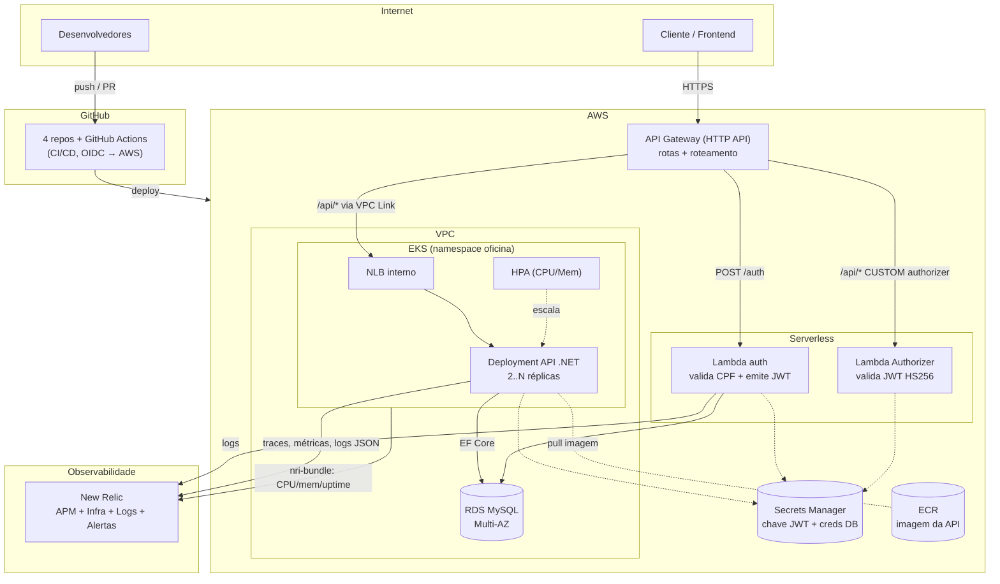

# Diagrama de Componentes

Visão de nuvem (AWS) com APIs, banco e monitoramento.

## Componentes

| Componente | Serviço AWS | Responsabilidade |
| --- | --- | --- |
| API Gateway | API Gateway (HTTP API) | Ponto único de entrada, roteamento e proteção das rotas `/api/*`. |
| Lambda auth | AWS Lambda (Node 20) | Valida CPF, consulta cliente no RDS, emite JWT. |
| Lambda Authorizer | AWS Lambda (Node 20) | Valida o JWT HS256 antes de encaminhar ao app. |
| API .NET | EKS (Deployment + Service/NLB) | Regras de negócio (OS, clientes, veículos, peças, serviços). |
| Escalabilidade | HPA + Cluster Autoscaler | Ajuste de réplicas/nós por CPU/memória. |
| Banco | RDS for MySQL (Multi-AZ) | Persistência transacional com alta disponibilidade. |
| Segredos | Secrets Manager | Chave do JWT e credenciais do banco (fonte única). |
| Registry | ECR | Imagens Docker da API. |
| Observabilidade | New Relic | APM, métricas de infra, logs estruturados, dashboards e alertas. |
| CI/CD | GitHub Actions | Build, testes e deploy automático (homolog/prod) por repositório. |
