# Modelo de Dados

## Diagrama ER

```mermaid
erDiagram
    CLIENTE ||--o{ VEICULO : possui
    CLIENTE ||--o{ ORDEM_SERVICO : abre
    VEICULO ||--o{ ORDEM_SERVICO : referenciado_em
    ORDEM_SERVICO ||--o{ ITEM_ORDEM_SERVICO : contem
    SERVICO ||--o{ ITEM_ORDEM_SERVICO : compoe
    PECA ||--o{ ITEM_ORDEM_SERVICO : compoe
    ORDEM_SERVICO ||--o{ NOTIFICACAO_OUTBOX : gera

    CLIENTE {
        int Id PK
        string CpfCnpj UK "único, indexado"
        string Nome
        string Email
        bool Ativo "NOVO — status p/ autenticação"
        datetime DataCriacao
    }
    VEICULO {
        int Id PK
        string Placa UK
        string Marca
        string Modelo
        int ClienteId FK
    }
    ORDEM_SERVICO {
        int Id PK
        string NumeroOS UK
        int ClienteId FK
        int VeiculoId FK
        int Status "enum 0..5"
        decimal ValorTotal
        bool OrcamentoAprovado
        datetime DataInicioExecucao
        datetime DataFinalizacao
    }
    ITEM_ORDEM_SERVICO {
        int Id PK
        int OrdemServicoId FK
        int Tipo "Servico|Peca"
        int ServicoId FK "nullable"
        int PecaId FK "nullable"
        decimal Quantidade
        decimal PrecoTotal
    }
    SERVICO {
        int Id PK
        string Nome
        decimal PrecoBase
        bool Ativo
    }
    PECA {
        int Id PK
        string Codigo UK
        string Nome
        decimal PrecoUnitario
        int QuantidadeEstoque
        bool Ativo
    }
    NOTIFICACAO_OUTBOX {
        int Id PK
        int OrdemServicoId FK
        int StatusAnterior
        int StatusNovo
        bool Enviado
    }
```

## Relacionamentos

- **Cliente 1—N Veículo** (cascade): excluir o cliente remove seus veículos.
- **Cliente 1—N OrdemServico** e **Veículo 1—N OrdemServico** (restrict): uma OS não
  deixa cliente/veículo órfãos; impede exclusão enquanto houver OS.
- **OrdemServico 1—N ItemOrdemServico** (cascade): os itens pertencem à OS.
- **ItemOrdemServico N—1 Serviço/Peça** (set null): o item referencia um serviço **ou**
  uma peça (discriminado por `Tipo`); apagar o cadastro base preserva o histórico do item.
- **OrdemServico 1—N NotificacaoOutbox**: cada transição de status gera um registro (padrão outbox).

## Justificativa da escolha do banco (MySQL / RDS)

1. **Modelo fortemente relacional e transacional.** O domínio é normalizado, com integridade
   referencial (FKs, cascatas/restrições) e transações na criação de OS e movimentação de
   estoque — cenário natural para um SGBD relacional, não NoSQL.
2. **Continuidade com a base existente.** A aplicação (Fases 1–2) já usa MySQL via EF Core;
   manter o motor evita troca de provider, regeração de migrations e retrabalho nos testes de
   integração (Testcontainers/MySQL), reduzindo risco.
3. **Serviço gerenciado com HA.** O Amazon RDS for MySQL oferece **Multi-AZ** (failover
   automático), backups, patching e métricas — atendendo alta disponibilidade e performance
   sem operar o banco manualmente.
4. **Custo/adequação.** Para a carga de uma oficina (mesmo multi-unidade), MySQL em instância
   pequena atende com folga; recursos como réplicas de leitura podem ser adicionados sob demanda.

> RFC completa: [RFC-002 — Escolha do banco de dados](rfcs/RFC-002-escolha-banco.md).

## Ajustes no modelo (Fase 3)

| Ajuste | Motivo |
| --- | --- |
| **`Cliente.Ativo`** (bool, default true) | A Function Serverless precisa consultar o **status** do cliente; clientes inativos não autenticam. |
| **Índice único `IX_Cliente_CpfCnpj`** | Já existente; garante unicidade e acelera a busca por CPF feita pela Lambda (consulta no caminho crítico de login). |
| Índices únicos em `Veiculo.Placa`, `Peca.Codigo`, `OrdemServico.NumeroOS` | Consistência de identificadores de negócio e performance de lookup. |
| `Status`/`Tipo` persistidos como `int` (enum) | Compactação e ordenação eficientes; semântica documentada no domínio. |
