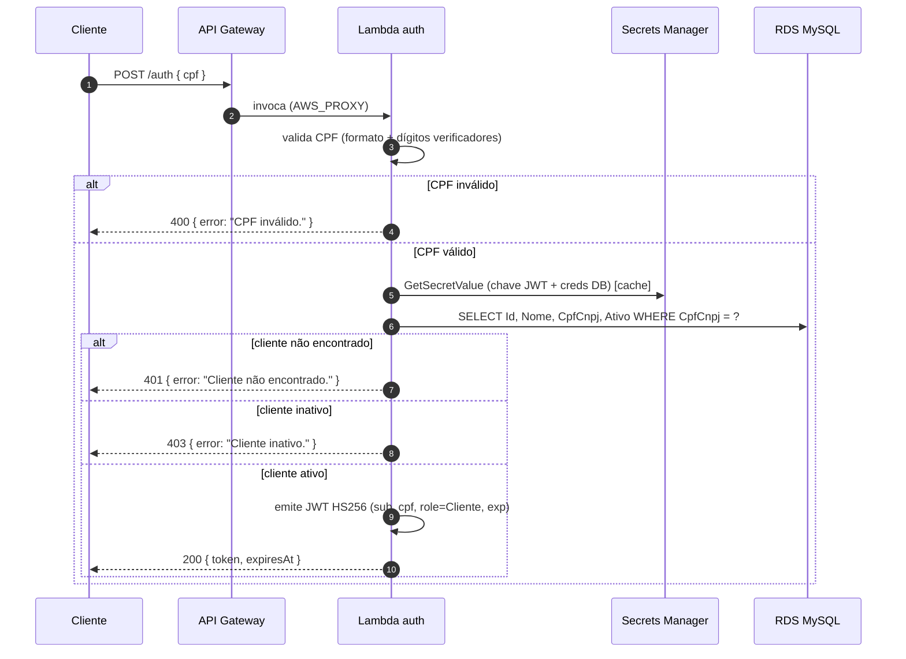
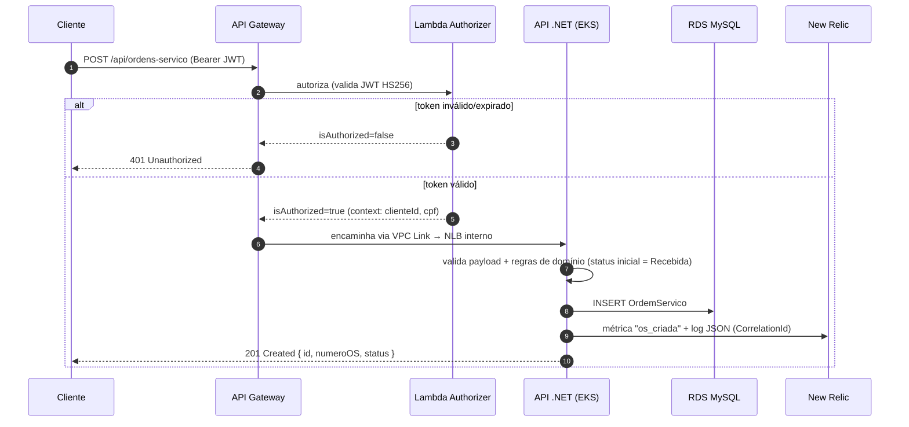

# Diagramas de Sequência

## 1. Autenticação por CPF

## 2. Abertura de Ordem de Serviço (rota protegida)

> O app .NET mantém validação JWT Bearer própria (defesa em profundidade), usando a
> mesma chave/issuer/audience via Secrets Manager.
