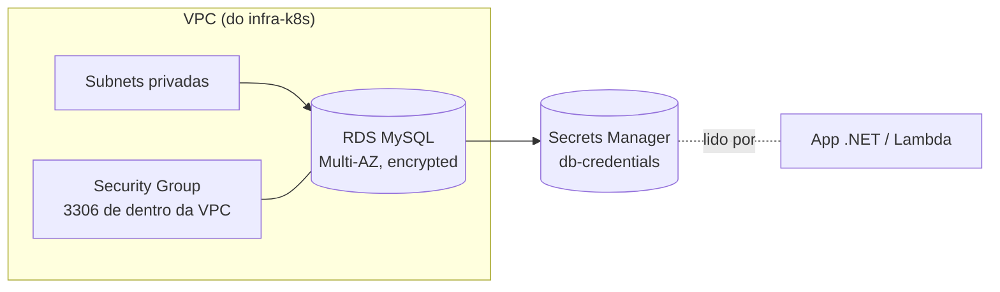

# oficina-infra-database

Infraestrutura como código (Terraform) do **banco de dados gerenciado** da Oficina Mecânica
(Tech Challenge FIAP 15SOAT — Fase 3): **Amazon RDS for MySQL** (Multi-AZ).

> Repositório 3 de 4.

## Propósito

Provisionar o RDS MySQL na VPC do cluster (repo `infra-k8s`), com credenciais geradas e
publicadas no **Secrets Manager**, consumidas pelo app (`oficina-app`) e pela Lambda
(`oficina-lambda-auth`).

## Tecnologias

- **Terraform** (provider AWS ~> 5.60), **Amazon RDS for MySQL 8.0**, **Secrets Manager**.
- Estado remoto em **S3** + trava **DynamoDB**. CI/CD com **GitHub Actions** (OIDC).

## Arquitetura



## Recursos

- `aws_db_instance` (MySQL 8.0, gp3, `storage_encrypted`, `multi_az`, backups 7 dias).
- `aws_db_subnet_group` nas subnets privadas do `infra-k8s` (via `terraform_remote_state`).
- `aws_security_group` liberando 3306 apenas de dentro da VPC.
- `aws_db_parameter_group` (utf8mb4).
- `aws_secretsmanager_secret` + versão com `{host,port,username,password,dbname}`.

## Executar / deploy

Pré-requisito: `infra-k8s` já aplicado (VPC/subnets existem). Deploy automático em `homolog`/`prod`:

```bash
terraform init -backend-config="bucket=<S3>" -backend-config="key=infra-database/homolog/terraform.tfstate" ...
terraform apply -var="environment=homolog" -var="state_bucket=<S3>"
```

Variáveis/segredos no repo: `AWS_DEPLOY_ROLE_ARN` (secret); `AWS_REGION`, `TF_STATE_BUCKET`, `TF_LOCK_TABLE` (variables).

## Outputs

`rds_endpoint`, `rds_port`, `db_secret_arn`, `db_security_group_id` — consumidos pelos repos `oficina-app` e `oficina-lambda-auth`.
