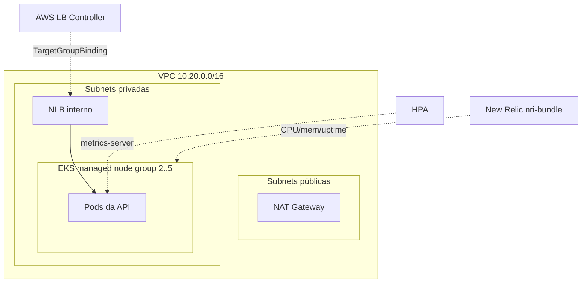

# oficina-infra-k8s

Infraestrutura como código (Terraform) do **cluster Kubernetes gerenciado** da Oficina
Mecânica (Tech Challenge FIAP 15SOAT — Fase 3): **VPC + Amazon EKS** com escalabilidade e add-ons.

> Repositório 2 de 4. É o **primeiro** a ser provisionado (cria a VPC usada pelos demais).

## Propósito

Provisionar a rede (VPC), o cluster **EKS** (managed node group com autoscaling), os add-ons
(metrics-server p/ HPA, AWS Load Balancer Controller, integração K8s do New Relic) e um **NLB
interno** para integração via VPC Link com o API Gateway.

## Tecnologias

- **Terraform** (provider AWS ~> 5.60, kubernetes, helm) e módulos `terraform-aws-modules/{vpc,eks,iam}`.
- **Amazon EKS** (Kubernetes 1.30), **metrics-server**, **AWS Load Balancer Controller**, **New Relic nri-bundle**.
- Estado remoto **S3** + trava **DynamoDB**. CI/CD **GitHub Actions** (OIDC).

## Arquitetura



## Recursos principais

- `module.vpc` — subnets públicas/privadas em 2 AZs, NAT único, tags para o LB Controller.
- `module.eks` — cluster + managed node group (`min/max/desired` configuráveis), IRSA habilitado.
- `helm_release` — metrics-server, aws-load-balancer-controller (IRSA), nri-bundle (se houver licença).
- `aws_lb`/`aws_lb_target_group`/`aws_lb_listener` — NLB interno (target IP) para o VPC Link.

## Executar / deploy

Deploy automático em `homolog`/`prod`. Requer `AWS_DEPLOY_ROLE_ARN`, `NEW_RELIC_LICENSE_KEY`
(secrets) e `AWS_REGION`, `TF_STATE_BUCKET`, `TF_LOCK_TABLE` (variables).

```bash
terraform init -backend-config="bucket=<S3>" -backend-config="key=infra-k8s/homolog/terraform.tfstate" ...
terraform apply -var="environment=homolog"
```

## Outputs

`cluster_name`, `cluster_endpoint`, `oidc_provider_arn`, `vpc_id`, `vpc_cidr`,
`private_subnet_ids`, `nodes_security_group_id`, `app_listener_arn`, `app_target_group_arn`
— consumidos por `infra-database`, `oficina-lambda-auth` e `oficina-app`.
