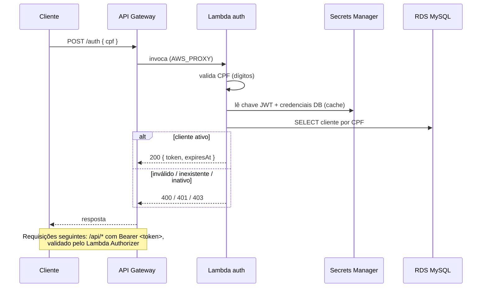

# oficina-lambda-auth

Function Serverless de **autenticação por CPF** da Oficina Mecânica (Tech Challenge
FIAP 15SOAT — Fase 3). Recebe um CPF, valida, consulta o cliente no banco gerenciado
e devolve um **JWT** válido para consumir as APIs protegidas via API Gateway.

> Repositório 1 de 4. Os demais: `oficina-infra-k8s`, `oficina-infra-database`, `oficina-app`.

## Propósito

- Expor `POST /auth` (público) que autentica o cliente por CPF e emite um JWT (HS256).
- Prover um **Lambda Authorizer** que valida esse JWT nas rotas `/api/*` do API Gateway,
  protegendo o app hospedado no EKS.

## Tecnologias

- **Node.js 20 + TypeScript**, empacotado com **esbuild**.
- **jsonwebtoken** (JWT HS256), **mysql2** (RDS MySQL), **AWS SDK v3** (Secrets Manager).
- **AWS Lambda + API Gateway (HTTP API)**, provisionados com **Terraform**.
- Testes com **Vitest**. CI/CD com **GitHub Actions**.

## Arquitetura



## Contrato da API

`POST /auth`

```jsonc
// Request
{ "cpf": "529.982.247-25" }
// 200 OK
{ "token": "eyJhbGciOiJIUzI1NiIs...", "expiresAt": "2026-09-06T19:00:00.000Z" }
```

Erros: `400` CPF inválido · `401` cliente não encontrado · `403` cliente inativo.

- **Coleção Postman/Insomnia:** [`docs/postman_collection.json`](docs/postman_collection.json).
- O Swagger das APIs protegidas fica no repositório `oficina-app`.

## Executar e testar localmente

```bash
npm ci
npm run typecheck
npm test          # Vitest — validação de CPF + fluxo de auth (JWT round-trip)
npm run build     # gera dist/handler.js e dist/authorizer.js
```

Os testes não dependem de AWS/DB (dependências injetadas). Para testar contra um MySQL
real, exporte `JWT_SECRET_ID`/`DB_SECRET_ID` e invoque via SAM/local runtime.

## Deploy

Automático via GitHub Actions ao dar merge em `homolog` ou `prod` (`.github/workflows/cd.yml`):
build → `dist/lambda.zip` → `terraform apply`. Variáveis/segredos necessários no repo:

| Tipo | Nome |
| --- | --- |
| Secret | `AWS_DEPLOY_ROLE_ARN`, `JWT_SECRET_ID` |
| Variable | `AWS_REGION`, `TF_STATE_BUCKET`, `TF_LOCK_TABLE` |

O Terraform consome os outputs dos repositórios de infra (VPC/subnets/NLB do `infra-k8s`
e endpoint/secret do `infra-database`) via `terraform_remote_state`.

## Deploy ativo

- **Endpoint (homolog):** _adicionar URL do API Gateway após o apply_
